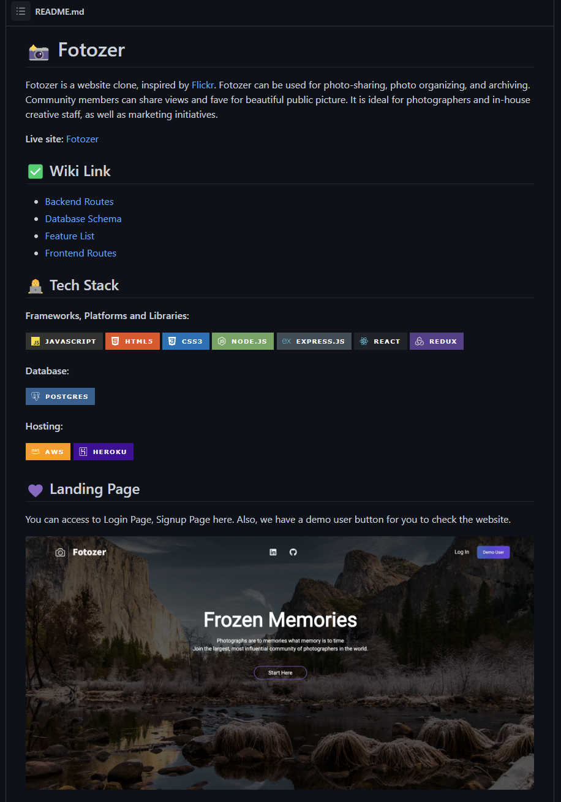
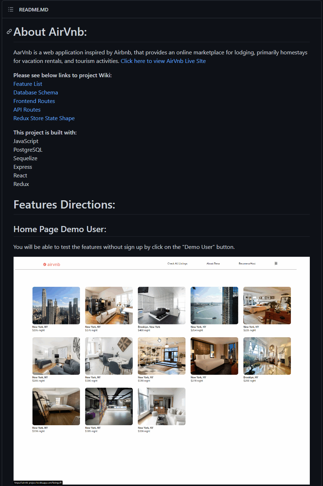
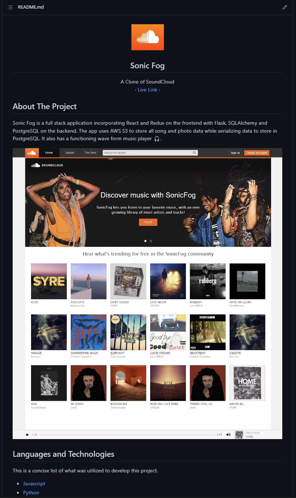
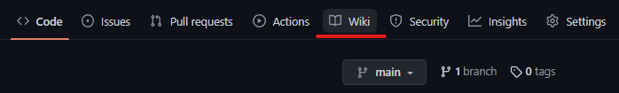
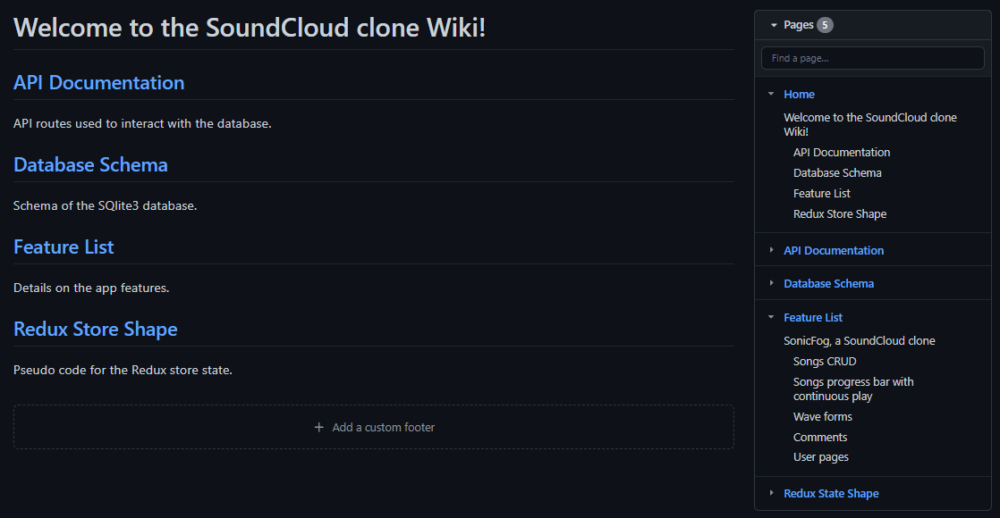
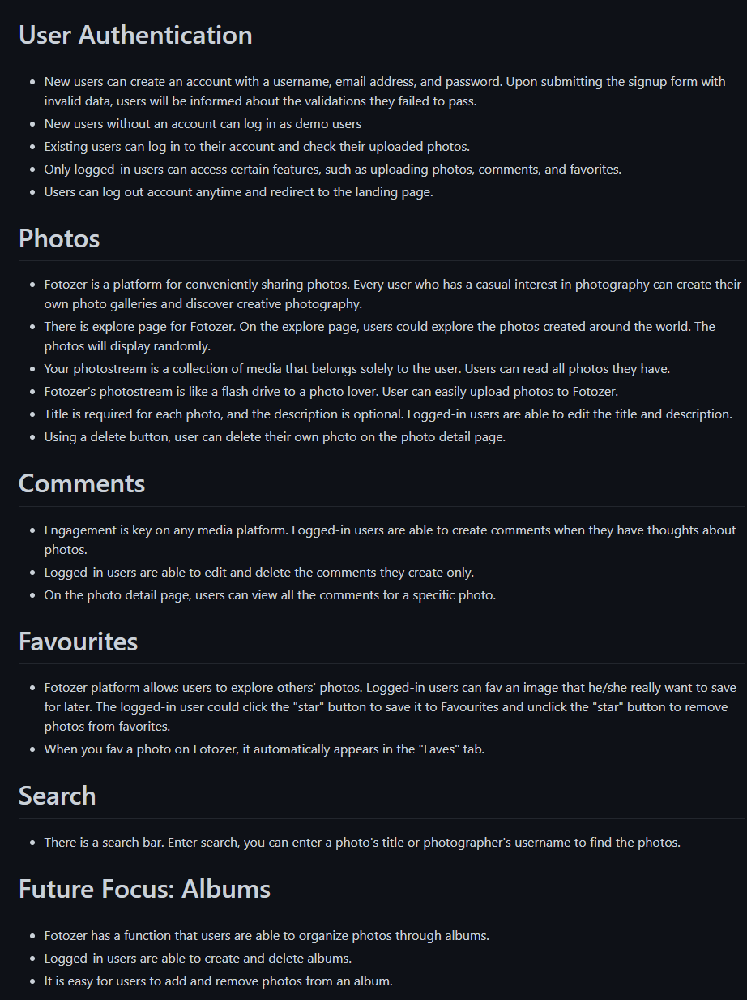

# GitHub README and Wiki Guidelines

  <a href="./README.md">Back to project week README</a>

Every great project needs great documentation, including a README and a Wiki.
Complete documentation answers the following questions:

1. What is your project, what does it do, and how was it designed?
2. How can someone run, develop and use your code?
3. How can you be contacted or asked a question?

## Checklist for Documentation Completion

- `/` **README.md**
  - Located at project root (`/`).
  - Link to live site.
  - Brief description of your site.
  - List of technologies used.
  - Usage descriptions of features.
    - Images and/or GIFs of your own site showcasing and additional insight
      some functionality.
  - Road map or to do list for future features.
  - Get started section with instructions on how to set up the repo to run the
    project locally.
  - Contact information.
- `/backend` **README.md**
  - The **README.md** you made in Mod 4 should now be the default **README.md**
    in the root of your /backend
    - You do not need to edit this file further after moving it.
- **Wiki**
  - Separate each of these into their own pages on the Wiki.
    - API routes.
      - List the documentation you have from mod 4.
    - Database schema image with relationships.
    - Features list.
      - Include descriptions and some details. This does not need to be as
        detailed as user stories
    - Redux state shape (this entry is for your development benefit in Mod 5. For security reasons it should be removed after you graduate).

## Resources

These are resources and documentation that may be useful in facilitating the
generation of documentation for your projects.

- [GitHub Docs About READMEs][github-about-readmes]
  - Official documentation for setting up GitHub documentation.
- [GitHub Docs Basic Formatting Syntax (Markdown)][github-markdown]
  - Markdown syntax is very useful for organizing your documentation on GitHub.
- [Best-README-Template][best-readme-template]
  - README template that is similar to the above suggestions. This may be
    useful for inspiration.

## README Examples

Note, parts of this documentation will only be completable once most of your
project is complete, such as images of your web app. Most students complete their READMEs once their app is relatively finished.

- Flicker Clone

- AirBnb Clone

- SoundCloud Clone

## Wiki

Each project you make is expected to have thorough supporting documentation.
Most documentation will be in the Wiki. This is a separate section that will
have many subsections of your GitHub repo.

Use the documentation you created in mod 4 (database schema and API
documentation) for these sections.

### Wiki Home Example

The Wiki Home is the landing page of the Wiki section. Documentation is then
organized in subsections as "pages".

### Feature List Section Example

Details should be included but it does not have to be as thorough as user stories.

  <a href="#readme-top">Back to the top</a>

  <a href="./README.md">Back to project week README</a>

<!-- resources links -->

[best-readme-template]: https://github.com/othneildrew/Best-README-Template
[github-about-readmes]: https://docs.github.com/en/repositories/managing-your-repositorys-settings-and-features/customizing-your-repository/about-readmes
[github-markdown]: https://docs.github.com/en/get-started/writing-on-github/getting-started-with-writing-and-formatting-on-github/basic-writing-and-formatting-syntax#headings
