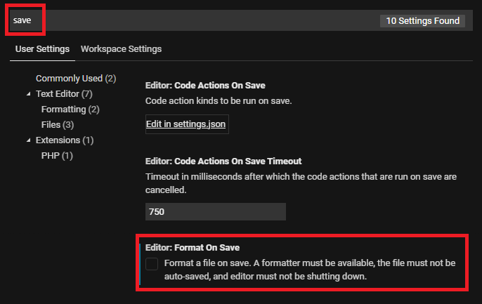
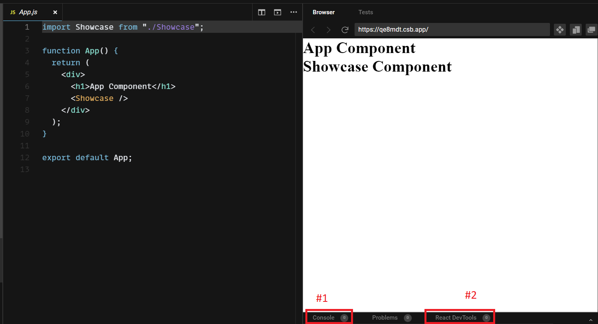
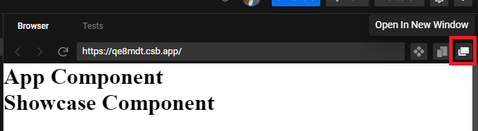
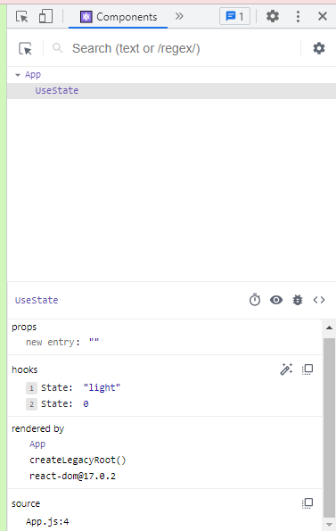

# CodeSandbox FAQs
## Table of Contents

 - [How can I save a Github repo as a sandbox?](https://github.com/flow-state-15/mod-5-extra-resources/blob/main/resources/codesandbox-FAQs.md#how-can-i-save-a-github-repo-as-a-sandbox)
 - [My files are not saving? / My changes aren't reflected in browser?](https://github.com/flow-state-15/mod-5-extra-resources/blob/main/resources/codesandbox-FAQs.md#my-files-are-not-saving-my-changes-arent-reflected-in-browser)
 - [How do I stop my code if its stuck in an infinite loop?](https://github.com/flow-state-15/mod-5-extra-resources/blob/main/resources/codesandbox-FAQs.md#how-do-i-stop-my-code-if-its-stuck-in-an-infinite-loop)
 - [How do I see React DevTools?](https://github.com/flow-state-15/mod-5-extra-resources/blob/main/resources/codesandbox-FAQs.md#how-do-i-see-react-devtools)
 - [I don't see my file structure or side navigation buttons, how do I get it back?](https://github.com/flow-state-15/mod-5-extra-resources/blob/main/resources/codesandbox-FAQs.md#i-dont-see-my-file-structure-or-side-navigation-buttons-how-do-i-get-it-back)
---------------------------
## How can I save a Github repo as a sandbox?
1. **While on the Github repo, in the URL, add "box" after "github".** The browser will reload the repo in CodeSandbox.
    - *Example:* `https://githubbox.com/appacademy/...`
2. **Make sure you are logged in to your own account so you can save your progress!** 
    - To register, click "Sign In" or go to https://codesandbox.io/signin and sign in using your Github or Google account. 
3. **Click the "Fork" button on the top-right.** 
5. After it reloads, it will assign a random name to the file and it will be placed in `Drafts`:
    - *Example:*  
    - 
6. **Click the random name and change it to the name of the practice.** 
7. **Click on `Drafts` to the left of the name to move the file to a new folder** (`Drafts` is only temporary).
   - 
   - Either select `All Sandboxes` or an already created folder to store it in. 
   - Right-clicking will allow you to create a folder, too. 
-----------------------
## My files are not saving? / My changes aren't reflected in browser?
> Here are a few ways to try and fix your issue!
1. **First off, check if you are in the right App.js file.** If you did not use the above "Fork" method and instead clicked **File --> Save As..** and clicked enter on this popup:
    -  
    - Then codesandbox might've created another App.js in the wrong folder. If yes, then transfer your code to the correct App.js file and see if the changes are reflected/save is working now. If not, try the next step. 
2. **Sometimes the auto Format On Save setting causes a Save issue.**
    - In CodeSandbox click **(Ctrl or Cmd) + Shift + P**
    - Search "user settings" in the input field that pops up and select **Preferences: Open User Settings**
    - Search for "save" on the "Search Settings" input and uncheck **Editor: Format On Save**. 
    - 
    - Try to save now. If this did not fix your issue, try the next step.
4. **Transfer any code you have written in the current file outside of CodeSandbox, like a Google Document or Notepad.**
5. **Hard refresh your browser.** 
    - *Chrome & Firefox:*
	    - Windows: Hold **Ctrl** and then press the "Reload" button OR **F5**
	    - Mac: Hold **Cmd** +**Shift** and then press the "Reload" button OR **R**
6. **Test after Saving now.**
    - *Still not working?* Please try to screen record the behavior and contact us. 
-----------------------
## How do I stop my code if its stuck in an infinite loop?
1. **Make sure that *Infinite Loop Protection* is on in your configuration files. Click Edit on 'sandbox.config.json' to see this option.**
    - However, this protection doesn't work for everything, especially in incomplete code. 

2. **If your file is still frozen and you can't edit:** 
    - Append `runonclick=1` to the editor URL to stop the code from being automatically executed enabling you to edit your code to resolve it.
        - For example: "https://codesandbox.io/s/new?runonclick=1"

----------------------------
## How do I see React DevTools?
There are a couple ways to see the React DevTools. 
1. **The built-in Browser tab has the React DevTools at the bottom.**

    - #1 is where you can see the browser's console & #2 is how you see the React DevTools. 
    - Sometimes the React DevTools here take a while to load, so use the next option if it gives you trouble. ⤵
2. **The right-most button on the Browser tab has an "Open In New Window" where you can have it fullscreen.**
    - 
    - Next, open up the inspect tool! (Right-click then "Inspect" in the opened window) 
    - Navigate to the "Components" tab!
    - 

----------------------------

## I don't see my file structure or side navigation buttons, how do I get it back?
**You might accidentally be in the *Projects Beta*:**
 1. **Travel back to the Dashboard.**
    - 
 2. **If you see you are in the *Projects Beta* view, on the bottom left, click "Go to Sandboxes".**
     - 

-----------------------------
[Back to top ⤴](https://github.com/flow-state-15/mod-5-extra-resources/blob/main/resources/codesandbox-FAQs.md#codesandbox-faqs)
